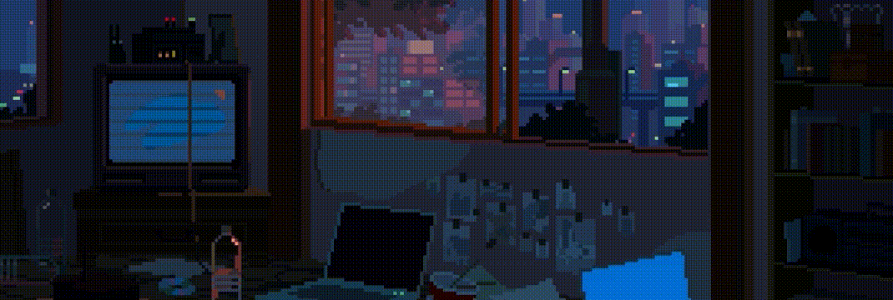

### Hi there 👋 I'm Miguel

🧑‍💻 I'm a Full-Stack Developer who loves making websites and applications. 
🚀 Constantly learning new technologies and building projects.  
📫 How to reach me: <a target="_blank" href="https://www.linkedin.com/in/miguel-l-302389249/">LinkedIn</a>  
🌐 My website: <a target="_blank" href="https://mler.dev">mler.dev</a>  

<h3> 🛠 &nbsp;Tech Stack</h3>

 

 

<!--
**m-ler/m-ler** is a ✨ _special_ ✨ repository because its `README.md` (this file) appears on your GitHub profile.

Here are some ideas to get you started:

- 🔭 I’m currently working on ...
- 🌱 I’m currently learning ...
- 👯 I’m looking to collaborate on ...
- 🤔 I’m looking for help with ...
- 💬 Ask me about ...
- 📫 How to reach me: ...
- 😄 Pronouns: ...
- ⚡ Fun fact: ...
-->
